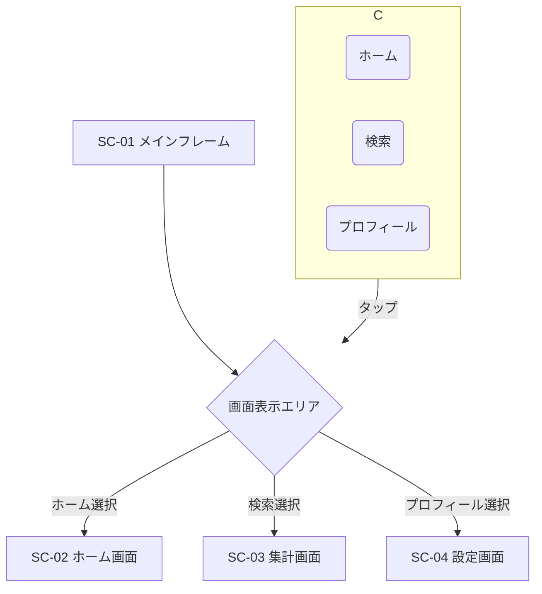
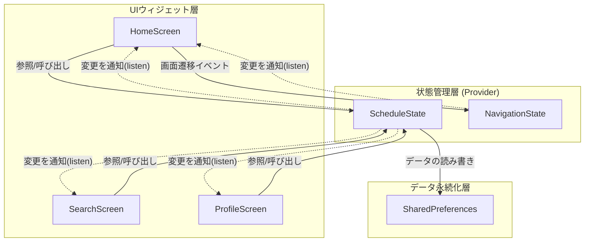

## 1\. 要件定義書

### 1.1. 概要

本アプリケーションは、主に学生をターゲットとした**出席管理アプリケーション**である。ユーザーが自身の履修する授業（時間割）を登録し、日々の授業の欠席・遅刻を手軽に記録・管理することを目的とする。記録されたデータは集計・可視化され、ユーザーが出席状況を容易に把握できるよう支援する。

### 1.2. 機能要件

| ID | 機能名 | 機能概要 |
| :--- | :--- | :--- |
| **FR-01** | **時間割管理機能** | ユーザーは授業の情報を登録、更新、削除できる。 |
| FR-01-01 | 授業登録 | 授業名、曜日、時限、開始時刻、終了時刻を指定して、新しい授業を時間割に追加できる。 |
| FR-01-02 | 授業削除 | 登録済みの授業を時間割から削除できる。 |
| **FR-02** | **出欠記録機能** | ホーム画面から、その日の授業に対して「欠席」または「遅刻」を記録できる。 |
| FR-02-01 | 欠席記録 | 「欠席」ボタンを押すと、対象授業の欠席回数が1回加算される。 |
| FR-02-02 | 遅刻記録 | 「遅刻」ボタンを押すと、対象授業の遅刻回数が1回加算される。 |
| FR-02-03 | 記録制限 | 同一授業に対する欠席・遅刻の記録は、1日1回までとする。 |
| **FR-03** | **ホーム画面機能** | アプリ起動時に表示されるメイン画面で、今日の授業情報を表示する。 |
| FR-03-01 | 現在授業中の表示 | 現在時刻が授業時間内の場合、その授業を大きく目立つカードで表示する。 |
| FR-03-02 | 本日の授業一覧 | 今日の曜日全ての授業を時限順に一覧で表示する。 |
| **FR-04** | **出欠状況集計機能** | 全ての授業の欠席・遅刻状況をまとめて確認できる。 |
| FR-04-01 | 総合サマリー表示 | 全授業の累計欠席回数と累計遅刻回数を表示する。 |
| FR-04-02 | 授業別詳細表示 | 欠席または遅刻が1回以上ある授業を一覧で表示し、授業ごとの回数を確認できる。 |
| **FR-05** | **データ管理機能** | 登録した全授業データと出欠記録を一括でリセットできる。 |

### 1.3. 非機能要件

| ID | 項目 | 内容 |
| :--- | :--- | :--- |
| **NFR-01** | **データの永続性** | 登録した時間割データおよび出欠記録は、アプリを終了しても保持される必要がある。デバイスのローカルストレージに保存する。 |
| **NFR-02** | **操作性** | ユーザーが直感的に操作できるよう、シンプルな画面構成と明確なナビゲーションを提供する。 |
| **NFR-03** | **プラットフォーム** | Flutterフレームワークがサポートするモバイルプラットフォーム（iOS, Android）で動作すること。 |

-----

## 2\. 外部設計書

### 2.1. 画面一覧

| 画面ID | 画面名 | ファイル名 | 概要 |
| :--- | :--- | :--- | :--- |
| **SC-01** | **メインフレーム** | `my_home_page.dart` | アプリ全体の骨格。AppBarとBottomNavigationBarを持ち、選択されたタブに応じてSC-02〜SC-04の画面を表示する。 |
| **SC-02** | **ホーム画面** | `home_screen.dart` | 今日の授業情報を表示する初期画面。 |
| **SC-03** | **集計画面** | `search_screen.dart` | 全授業の出欠状況をサマリーと詳細で表示する画面。 |
| **SC-04** | **設定画面** | `profile_screen.dart` | 授業の追加・削除、データリセットを行う管理画面。 |

### 2.2. 画面遷移図

ユーザーは画面下部の`BottomNavigationBar`をタップすることで、3つの主要画面（ホーム、集計、設定）を自由に切り替えることができる。



### 2.3. 画面レイアウト設計

#### 2.3.1. SC-01: メインフレーム

  * **AppBar**: 画面上部に配置。表示されている画面に応じて「ホーム」「検索」「プロフィール」のタイトルを表示する。
  * **Body**: 選択されているタブに対応する画面（SC-02, SC-03, SC-04）を表示する領域。
  * **BottomNavigationBar**: 画面下部に配置。「ホーム」「検索」「プロフィール」の3つのタブを持つ。

#### 2.3.2. SC-02: ホーム画面

  * **現在授業中のカード (`CurrentLectureCard`)**:
      * 条件：現在時刻が授業時間内の授業が存在する場合に表示。
      * 表示項目：授業名、授業ステータス（オンラインなど）、欠席・遅刻ボタン。
  * **本日の授業一覧 (`TodayLectureListItem`)**:
      * 今日の曜日の全授業を時限順にリスト表示するカード。
      * 各項目に時限、授業名、授業ステータス、欠席・遅刻ボタンを表示。

#### 2.3.3. SC-03: 集計画面

  * **総合サマリーカード**:
      * 全授業の「欠席合計」と「遅刻合計」を大きく表示。
  * **授業ごとの詳細リスト**:
      * 欠席または遅刻が1回以上ある授業をリスト形式で表示。
      * 項目には授業名、曜日、時限、欠席回数、遅刻回数を表示。

#### 2.3.4. SC-04: 設定画面

  * **データ管理セクション**:
      * 「授業データをリセットする」ボタンを配置。
  * **授業の追加・編集フォーム**:
      * 入力フィールド：曜日（ドロップダウン）、時限、授業名、開始時刻、終了時刻。
      * 「授業を追加/更新する」ボタンを配置。
  * **登録済みの授業一覧**:
      * 曜日ごとにグループ化されたExpansionTileで表示。
      * 各授業の横に削除ボタンを配置。

-----

## 3\. 内部設計書

### 3.1. アーキテクチャ

Providerパターン（`ChangeNotifier`と`Provider`）を用いた状態管理アーキテクチャを採用する。UIウィジェット層、状態管理層、データ永続化層の3層で構成される。



  * **UIウィジェット層**: `home_screen.dart`などの画面表示を担当。`context.watch`で状態の変更を監視し、`context.read`で状態のメソッドを呼び出す。
  * **状態管理層**: `schedule_state.dart`がアプリケーションのビジネスロジックと状態を管理する中心的な役割を担う。状態の変更は`notifyListeners()`を通じてUI層に通知される。
  * **データ永続化層**: `shared_preferences`ライブラリを使用し、`ScheduleState`内のデータをJSON形式でデバイスのローカルストレージに保存する。

### 3.2. データ設計

#### 3.2.1. データモデル (`schoolData`の構造)

`ScheduleState`内で管理される授業データ (`_schoolData`) は、以下の構造を持つネストされた`Map`で表現される。

```json
// SharedPreferencesに保存される際のJSON構造の例
{
  "monday": {
    "1": {
      "name": "情報工学実験3",
      "miss": 1,
      "Delay": 0,
      "official_miss": 0,
      "startTime": "09:00",
      "endTime": "10:30"
    },
    "2": {
      "name": "情報理論",
      "miss": 0,
      "Delay": 2,
      "official_miss": 0,
      "startTime": "10:40",
      "endTime": "12:10"
    }
  },
  "tuesday": {
    /* ... */
  }
}
```

#### 3.2.2. 永続化キー

`SharedPreferences`で使用するキーは以下の通り。

  * **授業データキー**: `'school_data_key'`
  * **当日アクション記録キー**: `'actions_YYYY-MM-DD'` (例: `'actions_2025-07-22'`)
      * このキーは毎日動的に生成され、日付が変わると前日の記録は参照されなくなる。

### 3.3. クラス設計

#### 3.3.1. `ScheduleState` (schedule\_state.dart)

アプリケーションの核となる`ChangeNotifier`。

  * **責務**:
      * 全授業データ（時間割、出欠カウント）の保持と管理。
      * データの永続化（SharedPreferencesへの読み書き）。
      * 出欠記録、授業のCRUD（作成、読み取り、更新、削除）操作のビジネスロジックの提供。
      * 状態変更時のUIへの通知 (`notifyListeners`)。
  * **主要プロパティ**:
      * `_schoolData`: 時間割データを保持するMap。
      * `_todaysActions`: その日に行われた出欠記録（欠席・遅刻）を追跡する`Set<String>`。キーは`"$day-$periodKey"`形式。
  * **主要メソッド**:
      * `_loadDataFromPrefs()`: 起動時にSharedPreferencesからデータを読み込む。
      * `_saveDataToPrefs()`: 状態変更時にデータをSharedPreferencesに保存する。
      * `incrementMiss(day, periodKey)`: 欠席カウントを+1する。`_todaysActions`をチェックし、重複記録を防ぐ。
      * `incrementDelay(day, periodKey)`: 遅刻カウントを+1する。同様に重複記録を防ぐ。
      * `addOrUpdateLecture(...)`: 新しい授業を追加、または既存の授業を更新する。
      * `deleteLecture(day, periodKey)`: 授業を削除する。
      * `resetSchoolData()`: 全ての授業データとアクションログを初期状態に戻す。

#### 3.3.2. `NavigationState` (navigation\_state.dart)

`BottomNavigationBar`の状態を管理するシンプルな`ChangeNotifier`。

  * **責務**: 現在選択されているタブのインデックスを保持し、UIに通知する。
  * **主要プロパティ**:
      * `_selectedIndex`: 現在のタブのインデックス。
  * **主要メソッド**:
      * `updateIndex(index)`: `_selectedIndex`を更新し、`notifyListeners()`を呼び出す。

### 3.4. 主要ロジック設計

#### 3.4.1. 出欠記録の1日1回制限ロジック

このロジックは`ScheduleState`内の`incrementMiss`/`incrementDelay`メソッドで実現される。

1.  ユーザーが「欠席」または「遅刻」ボタンをタップする。
2.  UIウィジェット（`TodayLectureListItem`など）が`scheduleState.incrementMiss(dayKey, periodKey)`を呼び出す。
3.  `incrementMiss`メソッド内で、まず`actionKey` (例: `"monday-1"`) を生成する。
4.  `_todaysActions`（`Set`型）にこの`actionKey`が含まれているか確認する。
      * **含まれている場合**: すでに今日アクション済みと判断し、何もせず処理を終了する。
      * **含まれていない場合**:
        1.  `_schoolData`内の該当する授業の`miss`カウントを+1する。
        2.  `_todaysActions`に`actionKey`を追加する。
        3.  `_saveDataToPrefs()`と`_saveTodaysActions()`を呼び出し、両方のデータを永続化する。
        4.  `notifyListeners()`を呼び出し、UIを更新する。

#### 3.4.2. 現在授業中の判定ロジック

このロジックは`HomeScreen`の`build`メソッド内で実行される。

1.  `DateTime.now()`で現在の日時を取得する。
2.  今日の曜日に該当する授業データを`schoolData`から取得する。
3.  取得した授業リストをループ処理する。
4.  各授業の`startTime`と`endTime`（`"HH:mm"`形式の文字列）を`TimeOfDay`オブジェクトに変換する。
5.  現在時刻と、授業の開始・終了時刻を「0時からの経過分数」に変換して比較する。
6.  `startMinutes <= currentMinutes < endMinutes`の条件が真となる授業を「現在授業中の授業」と判定し、専用の`CurrentLectureCard`ウィジェットで表示する。